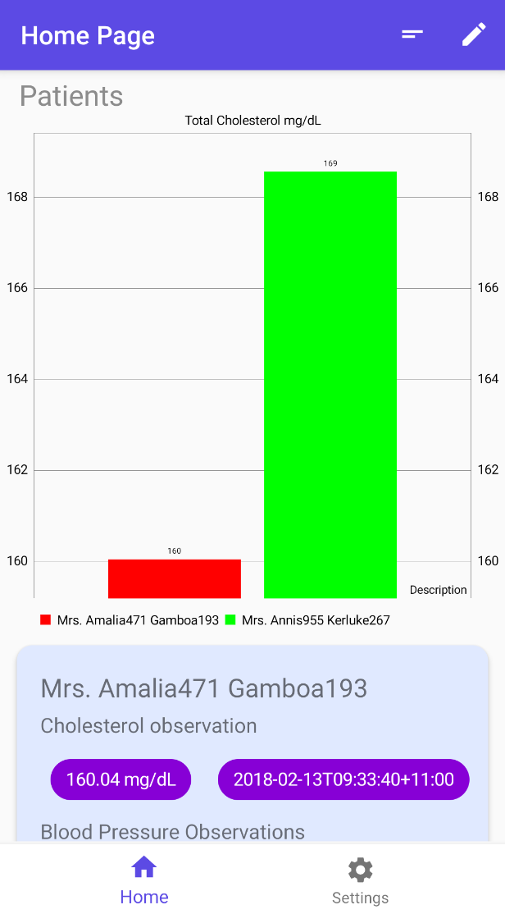
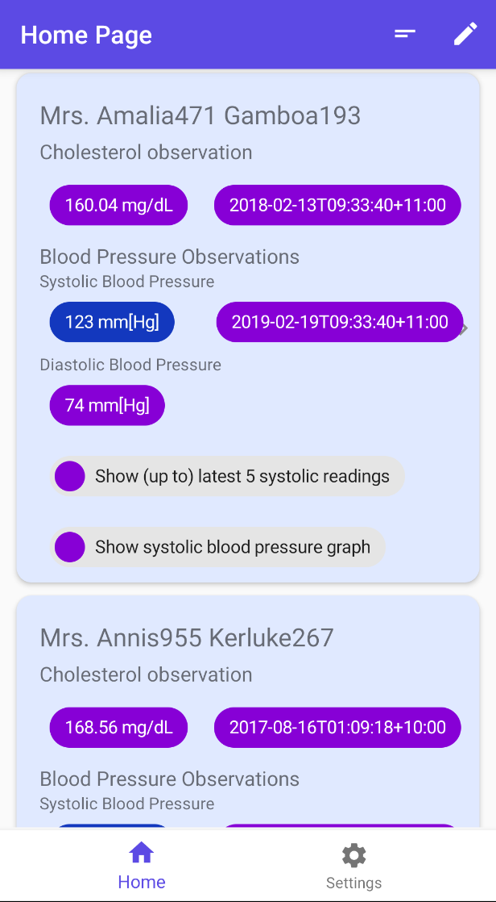

# FIT3077 Assignment 2 & 3 Semester 1 2020 <br> Software Architecture & Design 

The purpose of this assignment is to create an application that assists healthcare practitioners in monitoring patients by using the FHIR server. Our group has decided to create an Android mobile application which uses the ```hapi-fhir-android``` module to support getting data from the FHIR server. We are also required to apply design patterns and principles in our application. 

Our system applies the MVVM architecture proposed by the Android documentation. 

### Application creators
- Alex O 
- Hew Ye Zea (Jess)

### Technologies
- Android Studio
- ```hapi-fhir-android``` module
- ```MPAndroidChart``` module

### To run our app
1. Clone our project
2. Open android studio, open directory ```project/KMHC```
3. Sync gradle build
4. Press 'run'

#### Design principles & patterns 
Refer to ```project/DesignDocuments```.

#### Demo 
Refer to ```project/Video```.

#### Machine Learning bonus task
1. Open directory ```project/MachineLearning```
2. Open instructions.pdf for instructions on the machine learning task

### Screenshots 
     

### WBA
#### Assignment 2
Alex: backend (model, service & viewModel packages), machine learning & design documents. <br>
Jess: frontend (view, adapter packages & res) & video editing. 

#### Assignment 3
Alex: patient card graph, observation selection, refactoring backend & design documents. <br>
Jess: home page bar chart, graph modification, observation highlighting & video editing.

## Note

This repo has been created to share our project and for future students taking this unit to get an idea on what the assignment is about. However, we do not condone the act of plagiarism so only use our code as reference, if you wish.

## Plagiarism Notice

Copying or plagiarising code is a serious offence and will result in a breach in the Academic Integrity Policy
https://www.monash.edu/students/academic/policies/academic-integrity. We will not be held responsible for any of these breaches. 
